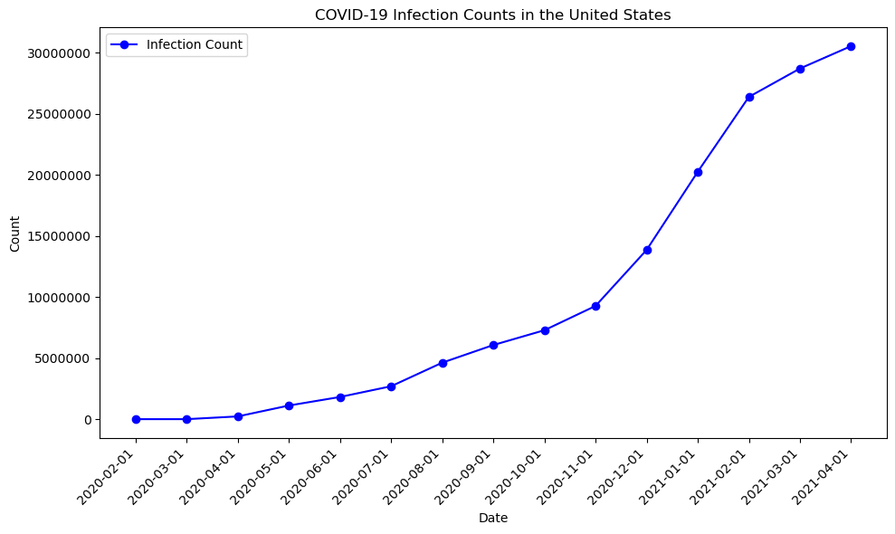
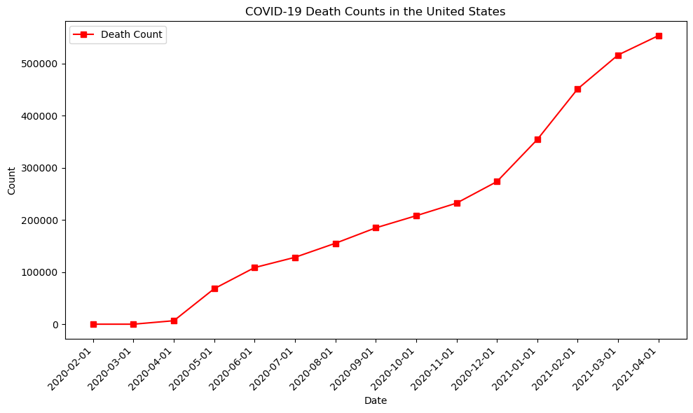
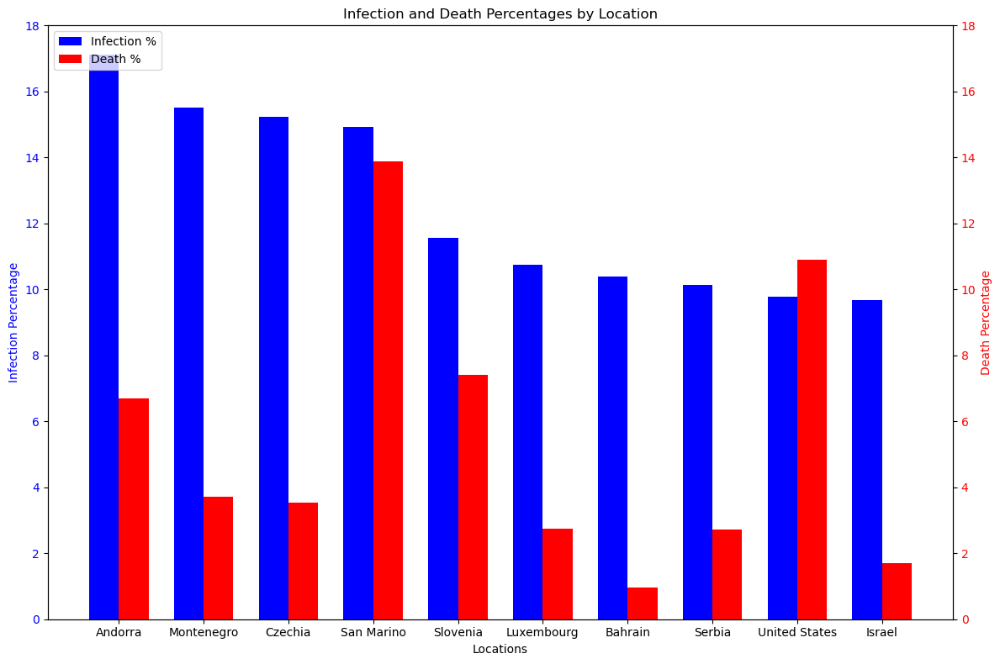

# Introduction
**Welcome to my COVID-19 Data Exploration project!** 
<br>In this project, I delve into the extensive realm of COVID-19 data to gain insights, uncover trends, and visualize patterns related to the global pandemic caused by the novel coronavirus. Using SQL query for exploratory data analysis and Python for data visualization, I aim to provide a comprehensive understanding of the pandemic's on various geographical regions. Join me on this journey as we navigate through data to shed light on the multifaceted aspects of the COVID-19 pandemic. 

🔍 Full SQL queries? Check them out here: [SQL Codes](https://github.com/JaewonGithub/CovidEDA/blob/main/project_sql/Q1~Q5_SQL_code.sql)<br> 
🔍 Full Visualization Python codes? They are here: [Python Codes](/project_python/)

# Background
The motivation to explore the dataset on COVID-19 is deeply rooted in the profound impact this global pandemic has had on all of us around the world, including myself. By immersing myself in the data and leveraging EDA techniques, I seek to uncover hidden trends, patterns, and correlations that can provide valuable insights into the dynamics of the pandemic. These insights not only inform my own understanding but also empower me to contribute meaningfully to the ongoing discourse surrounding COVID-19. Ultimately, my goal is to use data-driven insights to inform others about the significance of COVID-19 and contribute to the collective effort of addressing the challenges posed by it on a global scale.

Data hails from [Our World in Data](https://ourworldindata.org/covid-deaths) - contains COVID-19 information from 2020-01-01 to 2021-04-30. 

### The Questions answered throughout this project using SQL queries:
1. What were the cumulative global counts for COVID-19 infections and deaths as of April 30, 2021? 

2. How did the monthly counts of COVID-19 infections and deaths vary over time specifically for the United States?
3. Which ten countries had the highest infection rates, and what were their corresponding death rates?
4. Which countries exhibited the highest infection rates within each continent?
5. What is the correlation between the infection rate and other relevant variables, such as GDP per capita , ages, and population density?

# Utilized Tools
For this project, following tools were used:

1. **SQL:**  Used to query the database, serving as the primary tool for conducting exploratory data analysis (EDA) on the COVID-19 data.

2. **PostgreSQL:** Selected as the optimal database management system for efficiently managing the data for the analysis.  

3. **Python:** Matplotlib library within Python for data visualization, enabling the creation of visual representations of the outputs derived from SQL queries, thereby enhancing data comprehension and insights.

4. **Git:** Employed Git for version control and project management, facilitating the tracking of project progress.

5. **Visual Studio Code:** Utilized Visual Studio Code as the Integrated Development Environment (IDE), utilizing its terminal for executing Python scripts and extensions for SQL queries, enhancing productivity throughout the data exploration and analysis process.

# Analysis
 **Each query for this project aimed at drawing insights from COVID-19 data, here's the approach:**
<br>

### 1. Global significance of COVID-19
To identify the global infection count and death count of COVID-19, I filtered the date to be last date of the data, which is April 30th, 2021. The rows with missing location (country) were excluded.

```sql
SELECT 
	SUM(total_cases) AS global_infection_count,
	SUM(total_deaths) AS global_death_count
FROM (
	SELECT *
	FROM covid_deaths
	WHERE date = '2021-04-30' AND continent IS NOT NULL AND location IS NOT NULL
);
```
| global_infection_count | global_death_count |
|------------------------|--------------------|
|       151,398,759      |       3,180,223    |

### Breakdown:
- **Total Infection** - The staggering global infection count underscores the profound impact of COVID-19 on a worldwide scale, highlighting its widespread reach and severity.
- **Total Death** - With a death count surpassing 3 million, COVID-19's impact extends significantly to the fatality aspect, emphasizing the profound toll the pandemic has taken on human lives globally.

---
### 2. Looking into United States 
To delve deeper into the first question, I have narrowed my focus to the United States, which is my primary area of interest. Additionally, I have generated monthly reports to enhance the informativeness of visualizations.
```sql
SELECT 
	date,
	total_cases AS infection_count, 
	COALESCE(total_deaths , 0) AS death_count
FROM covid_deaths
WHERE
	location = 'United States' AND EXTRACT(DAY FROM date) = '1';
```
|     date     | infection_count | death_count |
|--------------|-----------------|-------------|
|  2020-02-01  |        8        |      0      |
|  2020-03-01  |       32        |      1      |
|  2020-04-01  |     224560      |    6652     |
|  2020-05-01  |    1115946      |   68140     |
|  2020-06-01  |    1816154      |  108609     |
|  2020-07-01  |    2693993      |  128304     |
|  2020-08-01  |    4623604      |  155240     |
|  2020-09-01  |    6068759      |  184832     |
|  2020-10-01  |    7281081      |  208074     |
|  2020-11-01  |    9270467      |  232229     |
|  2020-12-01  |   13858551      |  273540     |
|  2021-01-01  |   20252991      |  354242     |
|  2021-02-01  |   26382255      |  451408     |
|  2021-03-01  |   28706973      |  516483     |
|  2021-04-01  |   30541255      |  553570     |
```python
import pandas as pd
import matplotlib.pyplot as plt

data = pd.read_csv("C:\Users\wodnj\Desktop\Q2output.csv")
dates = [item["date"] for item in data]
infection_counts = [item["infection_count"] for item in data]
death_counts = [item["death_count"] for item in data]

fig1, ax1 = plt.subplots(figsize=(10, 6))
ax1.plot(dates, infection_counts, marker='o', label='Infection Count', color='blue')
ax1.set_xlabel('Date')
ax1.set_ylabel('Count')
ax1.set_title('COVID-19 Infection Counts in the United States')
ax1.ticklabel_format(style='plain', axis='y') 
plt.xticks(rotation=45, ha='right')
plt.legend()
plt.tight_layout()
plt.show()

fig2, ax2 = plt.subplots(figsize=(10, 6))
ax2.plot(dates, death_counts, marker='s', label='Death Count', color='red')
ax2.set_xlabel('Date')
ax2.set_ylabel('Count')
ax2.set_title('COVID-19 Death Counts in the United States')
plt.xticks(rotation=45, ha='right')
plt.legend()
plt.tight_layout()
plt.show()
```
 
### Breakdown:
- **Trend Analysis:** Observing the trend from the line chart, before July of 2020, the graph depicting infection counts shows a relatively flat slope, indicating a slower spread of COVID-19 during that period. However, starting from August 2020, there is a noticeable increase in the slope of curve, indicating a more rapid spread of the virus. This trend intensifies significantly from November 2020 to February 2021, where the infection count nearly triples within this period. The decreasing slope observed from February 2021 onward could potentially be attributed to the release and administration of better vaccinations and booster shots, which likely contributed to reducing the rate of new infections. 
<br></br>


### Breakdown:
- **Sudden Increase in April 2020:** The notable spike in infection counts observed in April 2020 may be attributed to the absence of widely available vaccinations for COVID-19 during that period. This lack of preventive measures likely contributed to the rapid spread of the virus within the population. Although the infection rate maintains a relatively consistent slope until November 2020, the death count experiences another sudden surge from that point onward. This could indicate exposure to new variants of COVID-19 for which the population was not adequately prepared, leading to increased fatalities.

- **High Correlation with Infection Count:** Analysis of the two graphs reveal a strong positive correlation between infection and death counts in the United States at various time points. The rate of increase in death counts mirrors the trend of infection count escalation, indicating a direct relationship between the spread of the virus and resultant fatalities. This correlation underscores the critical importance of controlling and mitigating the spread of COVID-19 infections to reduce associated mortality rates effectively.


### 3. What countries had highest infection rate?
To identify the 10 countries with the highest infection rates and their corresponding death rates, infection rates and death rates in percentage were calculated based on the data using the following query.
```sql
SELECT 
	location,
	population,
	MAX(total_cases) AS total_cases, 
	ROUND(MAX((total_cases/population) * 100),3) AS infection_percent,
	MAX(total_deaths) AS total_deaths,
	ROUND(MAX((total_deaths/total_cases)*100),3) AS death_percent
FROM 
	covid_deaths
WHERE NOT
	(continent IS NULL OR
	 total_cases IS NULL OR 
	 total_deaths IS NULL OR
	 population IS NULL)
GROUP BY 
	location , population
ORDER BY 
	infection_percent DESC
LIMIT 10;
```
| Location      | Population  | Total Cases | Infection Percent | Total Deaths | Death Percent |
|---------------|-------------|-------------|-------------------|--------------|---------------|
| Andorra       | 77,265      | 13,232      | 17.125%           | 125          | 6.702%        |
| Montenegro    | 628,062     | 97,389      | 15.506%           | 1,495        | 3.704%        |
| Czechia       | 10,708,982  | 1,630,758   | 15.228%           | 29,267       | 3.540%        |
| San Marino    | 33,938      | 5,066       | 14.927%           | 90           | 13.889%       |
| Slovenia      | 2,078,932   | 240,292     | 11.558%           | 4,250        | 7.400%        |
| Luxembourg    | 625,976     | 67,205      | 10.736%           | 796          | 2.756%        |
| Bahrain       | 1,701,583   | 176,934     | 10.398%           | 646          | 0.955%        |
| Serbia        | 6,804,596   | 689,557     | 10.134%           | 6,362        | 2.709%        |
| United States | 331,002,647 | 32,346,971  | 9.772%            | 576,232      | 10.909%       |
| Israel        | 8,655,541   | 838,481     | 9.687%            | 6,363        | 1.705%        |

```python
import pandas as pd
import matplotlib.pyplot as plt

data = pd.read_csv("C:\Users\wodnj\Desktop\Q3output.csv")

locations = [item["location"] for item in data]
infection_percentages = [item["infection_percent"] for item in data]
death_percentages = [item["death_percent"] for item in data]

fig, ax1 = plt.subplots(figsize=(12, 8))

index = np.arange(len(locations))
bar_width = 0.35

bar1 = ax1.bar(index, infection_percentages, bar_width, label='Infection %', color='blue')
ax1.set_xlabel('Locations')
ax1.set_ylabel('Infection Percentage', color='blue')
ax1.tick_params(axis='y', labelcolor='blue')

ax2 = ax1.twinx()
bar2 = ax2.bar(index + bar_width, death_percentages, bar_width, label='Death %', color='red')
ax2.set_ylabel('Death Percentage', color='red')
ax2.tick_params(axis='y', labelcolor='red')

ax1.set_ylim([0, 18])
ax2.set_ylim([0, 18])

bars = [bar1, bar2]
labels = [bar.get_label() for bar in bars]
plt.legend(bars, labels, loc='upper left')

plt.xticks(index + bar_width/2, locations, rotation=45, ha='right')
plt.title('Infection and Death Percentages by Location')

plt.tight_layout()
plt.show()

```


### Breakdown:
- **Country with the Greatest Infection Rate:** Surprisingly, Andorra, a European country known for its wealth, boasts the highest infection rate among the analyzed nations. This unexpected finding challenges common assumptions about wealth and healthcare infrastructure in relation to infection rates during the COVID-19 pandemic.
- **Lack of Correlation:** Analysis based on the bar chart reveals a notable lack of correlation between infection rates and death rates in certain countries. Despite having high infection rates, these countries exhibit varying death rates, indicating that the severity of COVID-19 outcomes may not be solely determined by the infection rate. This suggests that other factors such as healthcare capacity, treatment protocols, and demographics may significantly influence mortality rates.
- **High Death Rate Countries:** San Marino and the United States stand out for their unusually high death rates when infected with COVID-19, surpassing 10%. This observation underscores the complexity of COVID-19 outcomes and highlights the importance of understanding and addressing factors contributing to higher mortality rates in specific regions or populations.


### 4. Top paid skills for Data Scientist jobs
```sql
WITH top_paying_skills AS (
    SELECT *
    FROM
        job_postings_fact
        INNER JOIN skills_job_dim ON job_postings_fact.job_id = skills_job_dim.job_id
        INNER JOIN skills_dim ON skills_job_dim.skill_id = skills_dim.skill_id
    WHERE 
        job_title_short LIKE '%Data_Scientist%' AND
        salary_year_avg IS NOT NULL 
)
SELECT 
    skills,
    ROUND(AVG(salary_year_avg), 0) as avg_salary
FROM
    top_paying_skills
GROUP BY 
    skills
ORDER BY 
    avg_salary DESC
LIMIT 10;
```
| Skills        | Average Salary |
|---------------|----------------|
| Asana         | $200,284       |
| Airtable      | $189,600       |
| Redhat        | $189,500       |
| Watson        | $183,460       |
| Ringcentral   | $182,500       |
| Neo4j         | $170,861       |
| Elixir        | $170,824       |
| Lua           | $170,500       |
| Solidity      | $166,980       |
| Ruby on Rails | $166,500       |

Here's the breakdown of top paid skills for Data Scientist jobs:

- **Specialized Skills:** Skills like Neo4j (graph databases) and Solidity (blockchain development) offer competitive salaries, showcasing the value placed on niche or specialized expertise in certain technology domains.
- **Technology Sector Impact:** Skills related to cloud computing (Airtable, Redhat) and AI/ML (Watson) tend to have higher average salaries, reflecting the ongoing growth and investment in these sectors across industries.

### 5. Optimal skills to learn as a Data Scientist
Combining insights from demand and salary data, this query aimed to pinpoint skills that are both in high demand and have high salaries, offering a strategic focus for skill development. Also, included ratings column for better representation. (Tier 1 represents most optimal skills)
```sql
WITH optimal_skills AS (
    SELECT 
        skills_dim.skill_id,
        skills,
        COUNT(skills) AS demand_count,
        ROUND(AVG(salary_year_avg),0) as avg_salary

    FROM
        job_postings_fact
        INNER JOIN skills_job_dim ON job_postings_fact.job_id = skills_job_dim.job_id
        INNER JOIN skills_dim ON skills_job_dim.skill_id = skills_dim.skill_id
    WHERE 
        job_title_short LIKE '%Data_Scientist%' AND 
        salary_year_avg IS NOT NULL
    GROUP BY skills_dim.skill_id
    HAVING COUNT(skills) > 5
)
SELECT *,
    CASE 
        WHEN demand_count > 1000 AND avg_salary > 140000 THEN 'Tier 1'
        WHEN demand_count > 500 AND avg_salary > 140000 THEN 'Tier 2'
        ELSE 'Tier 3'
    END AS ratings
FROM 
    optimal_skills
ORDER BY 
    demand_count DESC , avg_salary DESC
LIMIT 20
```
| Skill ID | Skills       | Demand Count | Average Salary | Ratings | 
|----------|--------------|--------------|----------------|---------|
| 1        | python       | 5616         | $141,976       | Tier 1  |
| 0        | sql          | 4175         | $142,319       | Tier 1  |
| 5        | r            | 3177         | $138,714       | Tier 3  |
| 182      | tableau      | 1607         | $134,753       | Tier 3  |
| 76       | aws          | 1349         | $141,748       | Tier 1  |
| 92       | spark        | 1291         | $149,662       | Tier 1  |
| 99       | tensorflow   | 880          | $146,920       | Tier 2  |
| 74       | azure        | 823          | $135,560       | Tier 3  |
| 101      | pytorch      | 772          | $149,663       | Tier 2  |
| 97       | hadoop       | 767          | $141,181       | Tier 2  |
| 181      | excel        | 763          | $127,406       | Tier 3  |
| 186      | sas          | 762          | $125,255       | Tier 3  |
| 7        | sas          | 762          | $125,255       | Tier 3  |
| 4        | java         | 701          | $135,183       | Tier 3  |
| 93       | pandas       | 639          | $142,440       | Tier 2  |
| 183      | power bi     | 592          | $120,971       | Tier 3  |
| 3        | scala        | 531          | $146,704       | Tier 2  |
| 210      | git          | 520          | $131,711       | Tier 3  |
| 106      | scikit-learn | 513          | $145,940       | Tier 2  |
| 8        | go           | 460          | $153,973       | Tier 3  |

Here's the breakdown of optimal skills to learn as a Data Scientist:

- **Tier 1 Skills (High Demand, High Salary):** Python and SQL Widely demanded (5616 and 4175 job postings) with competitive salaries ($141,976 and $142,319). AWS and Spark offer substantial job opportunities (1349 and 1291 job postings) with attractive salaries ($141,748 and $149,662).
- **Tier 2 Skills (Moderate Demand, Competitive Salary):** TensorFlow, PyTorch, Hadoop, Scala, Pandas, and Scikit-Learn: Good demand (ranging from 513 to 880 job postings) with competitive salaries ($120,971 to $146,920).
- **Tier 3 Skills (Steady Demand, Varied Salary):** R, Tableau, Azure, Java, Excel, SAS, Power BI, Git, and Go: Exhibit steady demand (ranging from 460 to 3177 job postings) with varying salaries ($120,971 to $153,973). Specific roles within data science, analytics, and software development benefit from these skills.

# What I learned
Throughout this journey, I have significantly enhanced my SQL proficiency with advanced capabilities:

- 🧩 **Advanced Query Construction:** Mastered the intricacies of SQL by seamlessly merging tables and employing WITH clauses for sophisticated temporary table operations.

- 📊 **Data Aggregation Mastery:** Developed expertise in data summarization techniques using GROUP BY alongside aggregate functions like COUNT() , ROUND() and AVG(), enabling comprehensive data analysis.

- 💡 **Analytical Expertise:** Enhanced my problem-solving skills by translating complex questions into actionable SQL queries, generating valuable insights for decision-making processes.

# Conclusions
### Insights

1. **Top-Paying Data Scientist Jobs:** The highest-paying jobs for data scientists offer a wide range of salaries, the highest at $550,000. Furthermore, These top paid positions also offers remote work flexibility, reflecting the increasing global acceptance of remote work in the data science industry and providing professionals with more career flexibility.
***
2. **Skills for Top Paid Jobs:** The top-paid data scientist roles emphasize a broad range of skills including SQL, Python, Java, Scala, AWS, and Azure, highlighting the demand for diverse data manipulation and programming proficiencies. Additionally, advanced technologies like TensorFlow, PyTorch, Spark, Hadoop, and machine learning expertise are crucial for roles commanding higher salaries, underscoring the significance of big data analytics and distributed computing capabilities in the industry.
***
3. **Most In-Demand Skills:** Python and SQL remain dominant in the data science landscape due to their versatility and essential roles in data handling and analytics. Skills in R, SAS, Tableau, AWS, Azure, TensorFlow, PyTorch, and Spark are increasingly sought after, highlighting the industry's focus on data modeling, visualization, cloud-based analytics, and AI/ML technologies. This trend underscores the need for professionals with a diverse skill set spanning traditional data handling, advanced analytics, and emerging technologies for scalable data solutions and informed decision-making.
***
4. **Skills with Higher Salaries:** Specialized skills such as Neo4j and Solidity command competitive salaries due to their niche expertise in graph databases and blockchain development, respectively. Additionally, skills in cloud computing (Airtable, Redhat) and AI/ML (Watson) sectors show higher average salaries, indicating the significant impact of these technologies across industries.
***
5. **Optimal Skills for Job Market Value:** Python, SQL, AWS, and Spark remain top-tier skills due to their widespread use and high salary potential.
Machine learning frameworks like TensorFlow, PyTorch, and Scikit-Learn show promising demand and salary prospects. Visualization tools such as Tableau, Azure, and Power BI have moderate demand and are essential for data visualization and cloud-related tasks.

### Closing Thoughts
Engaging in this project has not only improved my SQL proficiency but also offered invaluable insights into the data scientist job landscape. The derived insights are instrumental in guiding the prioritization of skill enhancement and job search strategies. Aspiring data scientists can optimize their competitiveness in the job market by emphasizing the acquisition of in-demand, high-paying skills. This endeavor underscores the significance of ongoing learning and adaptability to stay on top of evolving trends in the data science domain.
